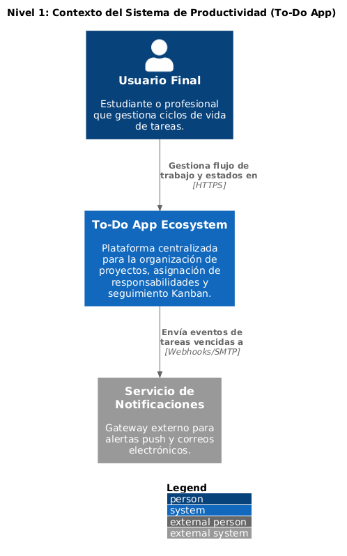
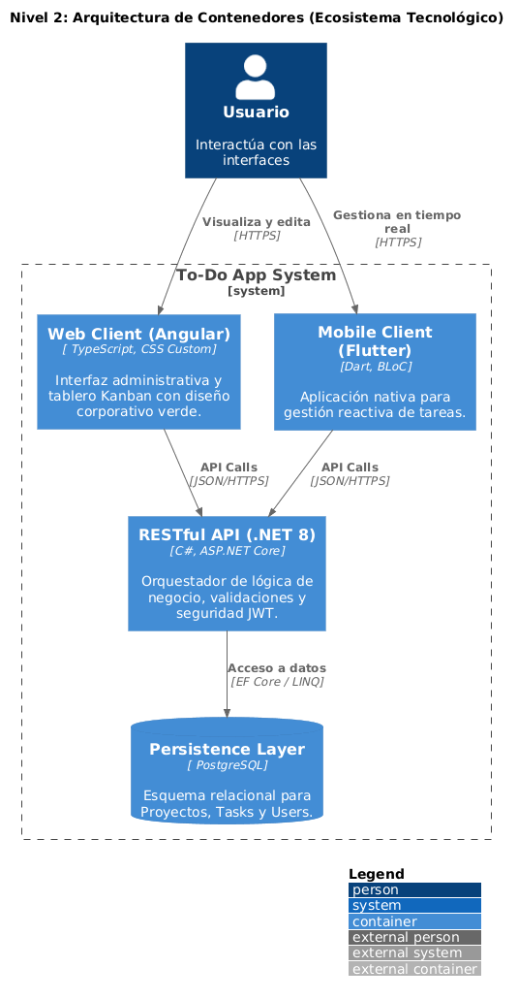
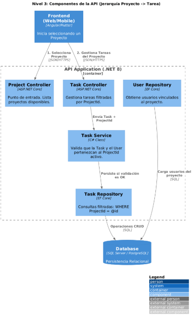
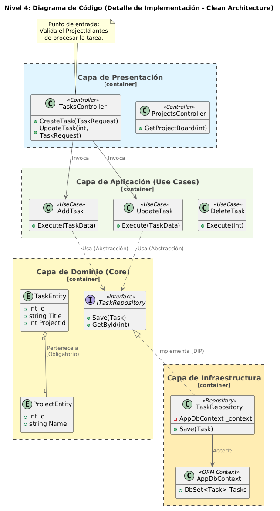

# 🧩 Modelo C4

Como parte del desarrollo del sistema, se definió la arquitectura utilizando el modelo C4, permitiendo representar la solución desde una visión general hasta el detalle interno.

---

## 🟢 C1 - Contexto

El sistema es una aplicación de gestión de tareas donde los usuarios interactúan mediante una aplicación web (Angular) y una aplicación móvil (Flutter).

Ambos clientes consumen una API desarrollada en ASP.NET Core, la cual gestiona la lógica del sistema y se conecta a una base de datos.

Además, se utiliza SignalR para comunicación en tiempo real.

---

## 🔵 C2 - Contenedores

El sistema está compuesto por los siguientes contenedores:

- Frontend Web (Angular)
- Aplicación móvil (Flutter)
- Backend API (ASP.NET Core)
- Base de datos (SQL Server)

### Comunicación:

- Frontend ↔ Backend → HTTP (REST)
- Backend ↔ Clientes → WebSockets (SignalR)
- Backend ↔ Base de datos → Entity Framework

---

## 🟡 C3 - Componentes

El backend está estructurado siguiendo Clean Architecture:

- **Controllers** → reciben las solicitudes HTTP
- **UseCases** → contienen la lógica de negocio
- **Repositories** → manejan el acceso a datos
- **Entities** → representan el dominio
- **DbContext** → conexión con la base de datos

Flujo:

Controller → UseCase → Repository → DbContext → Database

---

## 🔴 C4 - Código

A nivel de código se definen las siguientes clases principales:

### Entidades:
- TaskEntity
- ProjectEntity
- UserEntity

### Casos de uso:
- AddTask
- UpdateTask
- DeleteTask
- RestoreTask

### Interfaces:
- ITaskRepository

### Implementaciones:
- TaskRepository
- AppDbContext

Estas clases reflejan la separación de responsabilidades y el principio de inversión de dependencias.

---

## 💥 Justificación de la arquitectura

Se eligió Clean Architecture porque:

- Permite separar la lógica de negocio de la infraestructura
- Facilita el mantenimiento y escalabilidad
- Permite cambiar la base de datos o tecnología sin afectar el dominio
- Mejora la testabilidad del sistema

El uso del modelo C4 permitió estructurar y comunicar la arquitectura de forma clara y comprensible.